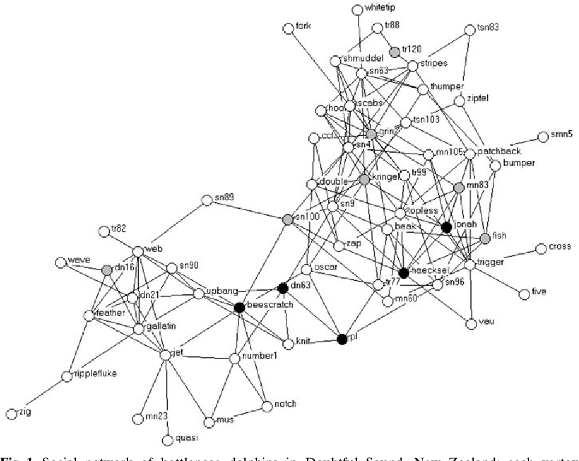

# Lab2: Animal Network Visualization

Programming Labs will take up to 4 hours and will walk the group through concepts and code that will be useful for future programming and written assignments.  While there is a handin, these are marked as completed/not completed, and the solution will be posted to Moodle by the end of the day.

:arrow_right: **Lab Day:** Tuesday, Sep 8

## :star: **Task A**: Dolphin Social Network

Before the programming component, we will do a "fast read" of the following paper:  [Evidence for Social Role in a Dolphin Social Network](https://arxiv.org/pdf/q-bio/0607048.pdf) by David Lusseau. Evolutionary ecology, 2007.  We will first read the abstract together.

Spend 15 minutes reading to answer these questions. You won't have all the details, but skimming papers is a useful skill when reading lots of literature.

1. What is the general hypothesis about animal social behavior that this study aims to test?
2. Why are bottleneck dolphins useful to study?
3. There are two behaviors that are noted - what are they and when are they observed?
4. How was the data collected? Are there any potential biases you see about the data collection?

We will discuss the questions after everyone has had some time looking for answers.


_Figure 1 from [Lusseau paper](https://arxiv.org/pdf/q-bio/0607048.pdf)._

## :star: **Tasks B & C**: Post a Test Graph to GraphSpace

GraphSpace is a webserver that allows researchers to interact with networks. It is located at [http://graphspace.org/](http://graphspace.org/).  

### :star: **Task B**: GraphSpace Preliminaries

First, make an account on GraphSpace: [http://graphspace.org/#signup](http://graphspace.org/#signup).  Use your Reed email for your `username`, and use something you are OK with sharing for your `password` (it's easiest to hard-code this in your files).

Once you have an account, click the following link to join the `BIO331F20` group. We will be able to share graphs in the class through this group.  You should be able to [see this graph](http://graphspace.org/graphs/29268?auto_layout=cose) after joining the group - have you seen it before?

Then, install the [`graphspace-python`](http://manual.graphspace.org/projects/graphspace-python/en/latest/index.html) library, which allows you to use Python to upload your own graphs to GraphSpace.  You should be able to install this module by opening a Terminal and typing
```
pip install graphspace_python
```

- If you get a permissions error and you're on a Mac, use `sudo`, which provides admin access so the package can be installed in the Python directory:
```
sudo pip install graphspace_python
```

- If you get an error that `pip` is not found and you are using Anaconda, try using `pip` within a `conda` environment: [here is some documentation](https://docs.conda.io/projects/conda/en/latest/user-guide/tasks/manage-environments.html#using-pip-in-an-environment).

- If you get an error that `pip` is not found and you are not using Anaconda, then try installing `pip` according to [these instructions](https://pip.pypa.io/en/stable/installing/).

Test that the packages are properly installed by uncommenting Line 10 of `lab2.py`, replacing `'YOUR EMAIL','YOUR PASSWORD'` with your GraphSpace email and password, and running `lab2.py` without an error.  Line 10 establishes a GraphSpace "session", which establishes a connection with the GraphSpace server.

### :star: **Task C**: Post a Graph to GraphSpace

You will now write a function that will post a test graph to GraphSpace. Documentation for [`graphspace-python`](http://manual.graphspace.org/projects/graphspace-python/en/latest/) and a [cheat sheet for posting graphs](https://cheatography.com/annaritz/cheat-sheets/graphspace-python-client/) will be useful.

Within the `post_test_graph()` function, complete the following:
1. Make a small graph with about five nodes and seven edges. Store them as a list of nodes (e.g., `['A','B',...]`) and a list of 2-element edges (e.g., `[['A','B'],['C','A'],...]`). The node names can be anything.

2. Create a GraphSpace Graph object (we'll call it `G`) that will be posted to GraphSpace.  Set the title and tags of this graph like so:
```
G = GSGraph()
G.set_name('Test Graph ' + str(time.time()))  ## this name is timestamped
G.set_tags(['Lab 2']) ## tags help you organize your graphs
```
`G` is currently empty; we now need to add nodes and edges to it.

3. Add nodes to your graph `G` using the `G.add_node()` function.  This function is called _on_ a GraphSpace graph object, and is part of the `graphspace_interface` library.  The function takes a required node ID (a string) and an optional node label (also a string). Use a `for` loop to add each node `n` in your node list using the following syntax:
```
G.add_node(n,label=n)
```

4. Add edges to your graph `G` using the `G.add_edge()` function using another `for` loop.  This function takes two strings as input, which are simply the edge's node names. For an edge `[n1,n2]`,
```
G.add_edge(n1,n2)
```

5. Now, you are ready to post the graph to GraphSpace. Uncomment the line `graph = post(G,graphspace)` which will post the graph to GraphSpace. (Note that the `post()` function handles the case when the graph is brand-new or already exists; it turns out to be pretty slow when replacing a graph, so the timestamp ensures that each graph you upload is "new.")

6. Finally, add node and edge styles using the options listed on the cheat sheet](https://cheatography.com/annaritz/cheat-sheets/graphspace-python-client/) and [user guide](http://manual.graphspace.org/projects/graphspace-python/en/latest/).  For each node (resp. edge), first add the element and then call `add_node_style()` (resp. `add_edge_style()`) a single time for each element. For example,
```
G.add_node(n,label=n)
G.add_node_style(n,color='red',shape='star',width=80)
```
HTML colors are allowed, e.g., `#73C8F3`.  You can select node and edge colors using the [HTML Color Picker](https://htmlcolorcodes.com/).

## :star: **Task D**: Post the Dolphin Network to GraphSpace

The Dolphin network described in the Lusseau paper has been parsed into a number of files:
- `dolphin_edgelist.txt` - edge list of dolphins by names
- `males.txt` `females.txt` `unknown-sex.txt` - dolphin names by sex
- `side-floppers.txt` - dolphins who had been observed side-flopping
- `upside-down-lobtailers.txt` - dolphins who have been observed upside-down lobtailing.

Parse all of this information (the `read_onecol()` and `read_multicols()` functions may be useful here).  Post the graph to GraphSpace of the dolphin social network annotated by **name** and **sex** of each dolphin, as well as whether that dolphin was a **side-flopper or upside-down lobtailer**.  The choice of annotation is up to you (color, size, shape, border, etc.).  Add a description of anntations you selected using the `set_data()` function (HTML formatting allowed):
```
G.set_data(data={'description': 'females=squares; males=circles; unknown=stars'})
```

Try out different layouts of the graph.  Click the "Change Layout" button to generate the graph using different automatic layouts. Save an automatic or manually generated layout.

**Optional**: You can also list the node details in the `popup` argument in the `G.add_node()` function, and label the nodes with the degree of each node.

## Submitting

:star2: **You're Done with Tasks A-D!**  No code handin is required. Instead, you will share your Dolphin network and any saved layouts with the `BIO331F20` Group.  

- **Share the graph with the group.**  You can use the `share()` function provided in `lab2.py` or share the graph using the website interface (click "share" in the upper right).  
- **If you saved any layouts, make sure they are also shared.**  Click the Layouts tab and select "share" for any layouts you want to share with the group.

Even though you aren't submitting your code here, follow these suggestions:
- Add comments to your code (this will be useful for posting subsequent graphs).
- All your code (except import statements and a `main()` call at the bottom of the file) should be within functions.
- Clean up your GraphSpace graphs by deleting the unused graphs.  On the page that displays all graphs, there is an option to remove each graph you have posted.
