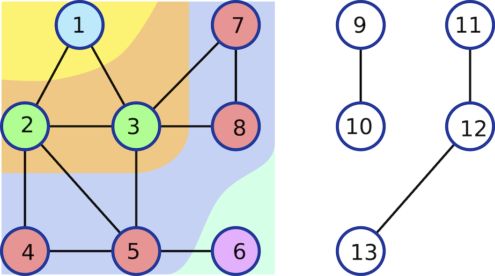
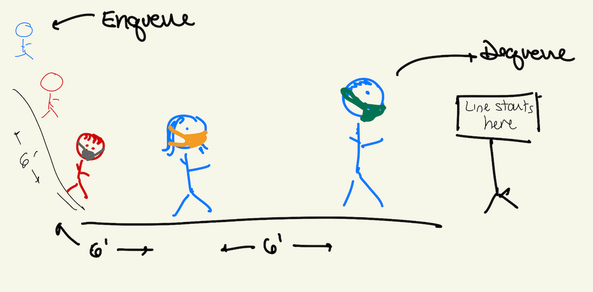
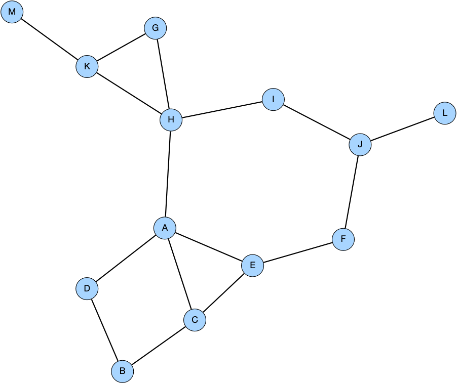

# Lab 3: Shortest Paths

In this lab, you will implement the shortest paths algorithm using a breadth-first search (BFS) traversal.  

:arrow_right: Lab Day: Tuesday, Sept 15

## Preliminaries Data Structure for BFS

In Monday's lecture, we talked at a high level how we can compute the shortest paths from a node `s` to all other nodes in `s`'s connected component.  Briefly, we start at `s` and "explore" the nodes in layers:



_Image Credit: TM Murali, Virginia Tech_

We need to explore the nodes in a particular way in order for this algorithm to compute the shortest paths.  We will store the nodes to explore using a [_queue_](https://en.wikipedia.org/wiki/Queue_(abstract_data_type)) data structure.

Queues are a First-In First-Out (FIFO) data structure; you add elements to the end of the queue ("enqueue") and you remove elements at the front of the queue ("dequeue"):


_Wikipedia_

Another way to think about a queue is as a line of people.  When you join the line, you join at the end; when someone leaves the line, the first get to go.



While there are Python queue implementations, it is simplest to maintain this as a list. Just be sure you are appending to the list and removing elements from the list in different places (take a look at the `list.pop()` description in the [Python Standard Library Documentation](https://docs.python.org/3.8/tutorial/datastructures.html)).

## :star: Task A: Run the Shortest Paths Algorithm on an Example graph

As a group, step through each line of the pseudocode below on an example network. Be sure to track:
- `D` -- Dictionary of Distances
- `Q` -- Queue of Nodes to Explore
- `exploring` -- The node currently being explored
- `neighbor` -- The neighbor of the node currently being explored

Click the Google Presentation below to work together (Anna will give you access):
- [Tuesday AM Lab](https://docs.google.com/presentation/d/18SrS-n_3UzoPFPY2mkmDX5MLJh2bF7uePl4LoMF-IiY/edit?usp=sharing)
- [Tuesday PM Lab](https://docs.google.com/presentation/d/1LN7uDA_Pckv5iTTsY4XHS5b9QhG24RXxgQbPNKN8OcY/edit?usp=sharing)

```
###########################################################################
## calculates the lengths of the shortest paths from
## node s to all nodes in the graph. Note: pseudocode!!
## Assume that s is a node in G.
ShortestPaths(G,s):
  D = {} # initialize and populate distances dictionary
  D[n] = inf for all nodes in n
  D[s] = 0

  Q = [s] # initialize and populate queue of nodes to explore

  while Q is nonempty:
    exploring = dequeue an element from Q
    for each neighbor in exploring's neighbors:
      if D[neighbor] == inf:
        D[neighbor] = D[exploring] + 1 # update distance to neighbor
        Enqueue neighbor to Q
  return D
###########################################################################
```

## :star: Task B: Implement the Shortest Paths Algorithm

Implement the shortest paths algorithm and post the graph to GraphSpace.  The `lab_utils.py` file contains a function to get two graphs, one from [`lab`](http://graphspace.org/graphs/29432?user_layout=13823), which has a few more nodes than the graph in the Google Slides, and one we saw from [`lecture`](http://graphspace.org/graphs/29433).  The `lab` network is shown below.



The function in `lab_utils.py` returns all the graph data structures we have learned about so far.  At the top of your code, add

```
import lab_utils
```

and when you're ready to get a graph (e.g. in your `main()` function), type

```
node_list, edge_list, adj_list, adj_mat = lab_utils.get_graph('lab') ## or `lecture'
```

Create your own Python `run.py` file and write code to get the `lab` graph (which is a single connected component).  Then, write a `shortest_paths()` function that takes a graph (from the data structures you choose) and a source node (which can be `A` for both graphs) and returns a dictionary of distances of all nodes to `A`.  

:question: How should you represent infinity?  You can either use `float('inf')` or use a very large integer (which needs to be larger than the number of edges in the graph).

When you are done, add code to post the graph to GraphSpace. Include the distances from `s` in each node's label to confirm that your code is working properly.  You can use any of your old code from Lab 2 or the previous programming assignment.

## :star: Task C: Color Nodes by Distance

We will now color the nodes according to the path length, where the nodes will have some "smooth" color range. The problem is, we don't know the length of the longest path, so we need to figure out how to color nodes automatically.  

**First, a crash course in numbers:** _Binary_ is base two. _Decimal_ is base ten. _Hexadecimal_ is base sixteen.  To count in decimal, binary, and hexadecimal, use the `format()` function. Add this code to your program and observe what happens:

```
print('decimal binary hexadecimal')
for i in range(20):
  print(i,format(i,'0b'),format(i,'0x'))
```

We'll discuss as a class why this some may find this funny:


_Credit: [cowbirdsinlove](http://cowbirdsinlove.com/)_

**RGB**: Colors are often specified as amount of `R`ed, `G`reen, and `B`lue (values between 0 and 1).

| (R,G,B) | Color | Color Name |
| -- | -- | -- |
| (0,0,0) |  | Black |
| (0,0,1) |  | Blue |
| (0.25,0.25,1) |  | Lighter Blue |
| (0.5,0.5,1) |  | Lighter Blue |
| (0.75,0.75,1) |  | Lighter Blue |
| (1,1,1) |  | White |

**HTML Color Codes**: The HTML color codes have the form `#RRGGBB`: `RR` is a two-digit hexadecimal number for Red; `GG` is a two-digit hexadecimal number for Green; and `BB` is a two-digit hexadecimal number for Blue.  The following snippet of code takes an RGB value and turns it into an HTML color code:

```
def rgb_to_hex(red,green,blue): # pass in three values between 0 and 1
  maxHexValue= 255  ## max two-digit hex value (0-indexed)
  r = int(red*maxHexValue)    ## rescale red
  g = int(green*maxHexValue)  ## rescale green
  b = int(blue*maxHexValue)   ## rescale blue
  RR = format(r,'02x') ## two-digit hex representation
  GG = format(g,'02x') ## two-digit hex representation
  BB = format(b,'02x') ## two-digit hex representation
  return '#'+RR+GG+BB
```

Color the nodes according to some color scale you choose within the `add_node_style()` function.  You will need to scale the distances to be between 0 and 1, but you have both the Red, Green, and Blue channels to adjust.  In addition to scaling the path distance `d` to be between 0 and 1, you can also consider using `1-d` in one or more channels.

:question: What about nodes with infinite distance? You may want to ignore nodes that are not connected (e.g. make them white).

## Submitting

:star2: **You're Done with Tasks A-C!**  No code handin is required. Instead, you will share your `lecture` network (and any saved layouts) with the `BIO331F20` Group.  

- **Share the graph with the group.**  You can use the `share()` function provided in `lab2.py` or share the graph using the website interface (click "share" in the upper right).  
- **If you saved any layouts, make sure they are also shared.**  Click the Layouts tab and select "share" for any layouts you want to share with the group.

Even though you aren't submitting your code here, follow these suggestions:
- Add comments to your code (this will be useful for posting subsequent graphs).
- All your code (except import statements and a `main()` call at the bottom of the file) should be within functions.
- Clean up your GraphSpace graphs by deleting the unused graphs.  On the page that displays all graphs, there is an option to remove each graph you have posted.
