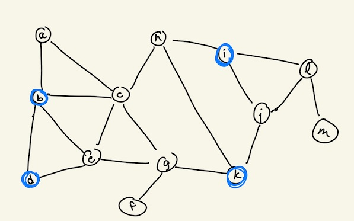
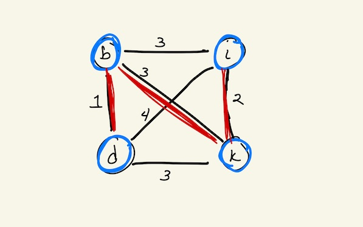
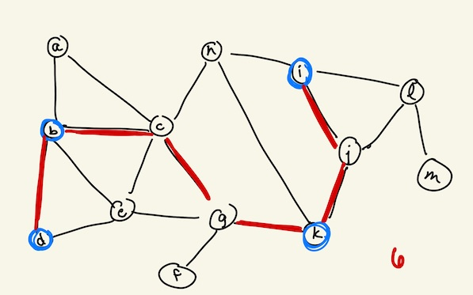
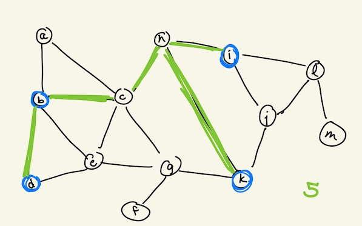

# Lab 4 - Steiner Tree Approximation

In this lab, you will implement most (if not all) the pieces to compute an approximation of the Minimum Steiner Tree problem.  Along the way, you will complete some parts of the Programming Assignment (this was unintentional, but will be quite useful).  We will use the following graph for this lab:



## 1. Run `lab4.py`

The `lab_utils.py` file contains many helper functions for this lab.  First, add your email and password in the `lab4.py` file and run it.  This code automatically visualizes a GraphSpace graph by calling functions from `lab_utils.py`.  

## 2. Compute the Shortest Paths in an Unweighted Graph

Begin by copying your `shortest_paths()` code over from Lab 3 or the Module 2 Programming Assignment. This function returns a dictionary `D` of the path lengths from a node `s` to all other nodes in the graph.  We need to be able to calculate the paths themselves.

Modify the function to include a new  _predecessor_ dictionary `pi`. A node's predecessor is the `exploring` node from which the shortest distance is calculated.  To calculate a path from A to C in a two-edge graph (A-B,B-C), the predecessor dictionary will be:

```
{'A':None,'B':'A','C':'B'}
```

The `pi` dictionary should be updated **every time** the distance dictionary is updated.

Once your code returns a `pi` dictionary, the `lab_utils.py` code has a `get_path()` function, which returns the shortest path from two nodes using the predecessor dictionary. If the predecessor dictionary above is assigned to the variable `pi`, then: `utils.get_path('A','C',pi)` returns `['A','B','C']` in the two-edge graph (A-B,B-C).

Calculate the shortest paths from node `'a'` in the graph and store the predecessor dictionary as `pi`. For every node `n` in the graph, print `get_path('a',n,pi)` and confirm by eye that the paths are correct. Note: A path is arbitrarily chosen in the case of tied shortest paths.

:star: This is part of **Task A** of the Programming Assignment - you can copy this code when you need it.

## 3. Compute the Metric Closure of the Graph

For the Steiner tree problem, we are given a graph _G_ and a set of terminals _L_ to connect.  The **metric closure** of _G_ on the nodes (terminals) _L_ is a weighted, undirected graph where the nodes are _L_ and the edges are all possible pairs of edges, and each edge is weighted by the cost of the shortest path between the two terminals in the original graph _G_.  The metric closure of the example graph is below, with edges and edge weights in black:



Write a `metric_closure()` function that takes the `terminals` and an adjacency list (`adj_list`) and returns two things:

1. `closure_edges`: a list of 3-element edges, where each edge is a list of `[u,v,weight]`.  

2. `predecessors`: a dictionary of (node,pi) key-value pairs.  Whenever you calculate the shortest paths starting at node `n`, set `predecessors[n]=pi`.

You can visualize the metric closure in GraphSpace with the line:

```
lab_utils.viz_graph(graphspace,terminals,closure_edges,terminals,[],'Metric Closure',weighted=True)
```

Note that `weighted=True` so the edges will be weighted according to the `closure_edges` 3-element lists.

## 4. Compute the Minimum Spanning Tree of the Metric Closure

An example minimum spanning tree of the metric closure is highlighted in red above, though there are many spanning trees that have the same cost.  The `lab_utils.py` file has a function to compute the minimum spanning tree of a weighted graph _G_.  It takes two inputs:

1. `nodes`: set/list of nodes in _G_

2. `weighted_edges`: list of 3-element edge lists of the form `[u,v,weight]` (similar to `closure_edges` above).

Run the `min_spanning_tree()` function to get a list of 2-element edges in the tree.  Print this list to confirm that it is working.  If you assign the returned variable to `MST`, you can visualize the minimum spanning tree of the metric closure with the line:

```
lab_utils.viz_graph(graphspace,terminals,closure_edges,terminals,MST,'Min Spanning Tree',weighted=True)
```

:question: What should you input for `nodes` and `weighted_edges` above? Think about which graph you want to compute the spanning tree of.

## 5. Expand the Minimum Spanning Tree to get the Steiner Tree Approximation



Finally, write an `expand_MST()` function that takes the spanning tree edges (in `MST`) and the predecessor dictionary from the metric closure (`predecessors`). The function returns a list of 2-element edges denoting the Steiner Tree approximation.  Follow this pseudocode.

```
###########################################################################
## Expands the minimum spanning tree on the metric closure
## of the graph to return the Steiner tree approximation.
## Assume that G is connected.  Note: pseudocode!!
expand_MST(MST,predecessors):
  final_edges = []
  for each edge (u,v) in the MST:
    path = shortest path from u to v in the original Graph (hint: use predecessors dictionary here)
    add edges in path to final_edges
  return final_edges
###########################################################################
```

Once you have written `expand_MST()`, you can visualize the final Steiner tree approximation with the line:

```
lab_utils.viz_graph(graphspace,nodes,edges,terminals,final_edges,'Steiner Approximation')
```

**Note:** Other pseudocode for this approximation, such as the one in the textbook, requires that you also ensure that adding each path does not introduce a cycle.  While this may happen with tied paths, we won't consider that here.

**Note:** There are many ties in the metric closure, and your choice of spanning tree and shortest path predecessor dictionary may result in different Steiner tree approximations.  The following examples is just as likely as the example above, though they have different overall weights:


